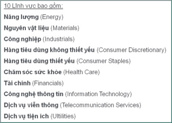
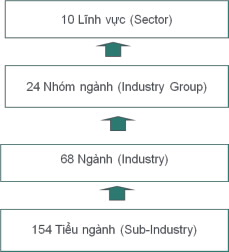
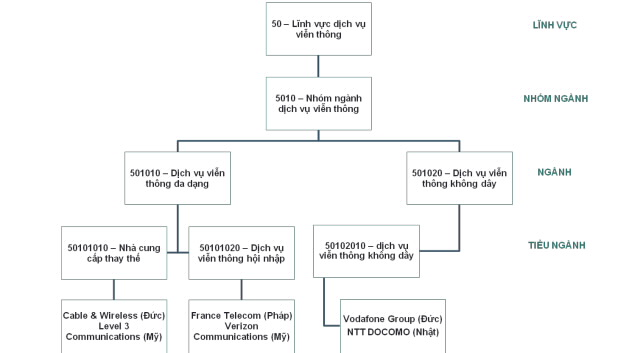
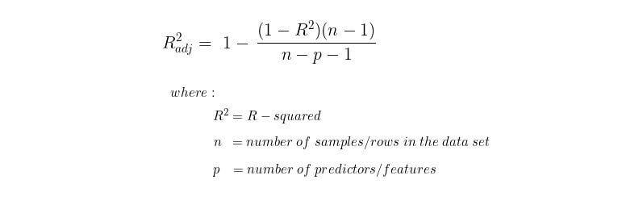

# **Summary of the Paper: A Comparison of Industry Classification Schemesfor Capital Market Research**

---

## Introduction
The article compares four prominent industry classification schemes used in financial research and capital markets: **SIC (Standard Industrial Classification)**, **NAICS (North American Industry Classification System)**, **GICS (Global Industry Classification Standard)**, and **FF (Fama-French Classification)**. The study investigates how each classification impacts the ability to explain economic similarity and stock return comovements among firms, addressing whether a scheme’s structure benefits from inherent advantages or biases.

---

## Knowledge Related

### Explanation of Sector, Industry Group, Industry, and Sub-Industry


1. **Sector**: 
   - The highest level in an industry classification system, grouping broad areas of economic activity. For example, sectors like **Technology**, **Healthcare**, or **Finance** encompass various industries that share similar high-level economic roles.

   

2. **Industry Group**:
   - A subset within a sector that includes closely related industries. Industry groups provide more specific categories within a sector, helping to refine the classification. For instance, within the **Technology** sector, there could be an industry group called **Software & Services**.

3. **Industry**:
   - Within each industry group, an **industry** represents firms with more focused and related business activities. Industries enable a narrower classification, such as dividing the **Software & Services** group into **Application Software** and **IT Services** industries.

4. **Sub-Industry**:
   - The most granular level of classification, a **sub-industry** identifies firms with highly specific economic activities. Within the **Application Software** industry, for instance, sub-industries might differentiate between **Enterprise Software** and **Educational Software** firms.


 


>**Note**: These classification levels apply specifically to **GICS**. Each industry classification scheme (such as SIC, NAICS, and ISIC) has its own hierarchy and terminology for levels. Please consult detailed information on the specific classification scheme before applying it.
---
### **Industry Classification** 
**Industry classification schemes** organize firms to facilitate economic and financial analyses. The effectiveness of these schemes varies based on how accurately they capture industry-specific behaviors.

---
### **Classification Schemes**:
   - **SIC (Standard Industrial Classification)**: Developed by the U.S. government, SIC is widely used but is now being phased out in favor of NAICS.
   - **NAICS (North American Industry Classification System)**: Created collaboratively by the U.S., Canada, and Mexico, NAICS aims for more updated classification compared to SIC.
   - **GICS (Global Industry Classification Standard)**: A classification developed by Standard & Poor’s and MSCI, widely used in global financial markets.
   - **FF (Fama-French Classification)**: Tailored for academic research, the FF classification organizes industries to examine stock returns based on firm size and value.   


| Scheme           | 1st Digit (Broadest Level) | 2nd Digit           | 3rd Digit         | 4th Digit        | 5th Digit        | 6th Digit        | 7th Digit        | 8th Digit (Narrowest Level) |
|------------------|----------------------------|---------------------|-------------------|------------------|------------------|------------------|------------------|-----------------------------|
| **SIC**          | Division                   | Major Group         | Industry Group    | Industry         | N/A              | N/A              | N/A              | N/A                         |
| **NAICS**        | Sector                     |                     | Subsector         | Industry Group   | Industry         | National Industry| N/A              | N/A                         |
| **GICS**         | Sector                     |                     | Industry Group    |                  | Industry         |                  | Sub-Industry     |                             |
| **FF**           | Industry                   |                     | N/A               | N/A              | N/A              | N/A              | N/A              | N/A                         |

---
### **Adjusted R-square**
This metric in the Paper measures how well a classification scheme explains stock return variations. The **Adjusted R-square** accounts for the number of independent variables used, providing a more accurate reflection of a model’s explanatory power without overfitting.


>[For more information](https://builtin.com/data-science/adjusted-r-squared)
---

### Economic Indicators 
 * **Price-to-Book (P/B) Ratio**:
 * **Enterprise Value-to-Sales (EV/S) Ratio**:
 * **Price-to-Earnings (P/E) Ratio**:
 * **Return on Equity (ROE)**:

## Data
The study uses data from **S&P 1500** firms, covering various sectors. The analysis includes:
   - **Firm stock returns**: To observe comovements and compare similarities among firms within industry groups.
   - **Financial metrics**: Such as **price-to-book (P/B) ratios**, **enterprise value-to-sales (EV/S) ratios**, and **profitability ratios** (e.g., ROE, ROA) to assess the economic relatedness across industry classifications.


---

## Results

* **Performance of GICS**: GICS consistently outperforms SIC, NAICS, and FF in explaining cross-sectional variations in firm-level returns, valuation multiples, and financial ratios. The study finds that GICS classifications explain, on average, 26.3% of monthly stock return variations compared to 22.9% for SIC.
* **Homogeneity in Valuation Multiples**: GICS also shows higher explanatory power for valuation multiples, especially for large-cap firms, making it more effective for classifying economically related firms.
* **Analyst Growth Forecasts**: The authors find that GICS classifications are more aligned with analyst forecasts, suggesting it better reflects market perceptions.

### **Key Findings to Note**


**TABLE1**
> This table reports univariate statistics for each classification level for SIC (Standard Industrial Classification), NAICS (North American Industry Classification System), Fama-French, and GICS (Global Industry Classification Standard), using S&P 1500 firms as of December 2001. 

> Fama-French refers to the industry classification system developed in their paper "Industry Costs of Equity" (1997).

> Panel A reports the number of classification levels, the official number of categories, and the functional number of categories for each classification level for each level of classification. A category is defined as functional if it has at least five members.

> Although some research uses the first digit as the broadest level, SIC codes are officially broken into 11 major divisions, labeled A through K. The sixth digit of the NAICS code is an additional level of detail specific to each country. For comparison purposes, the categories in the fifth and sixth digit levels are combined in this table, consistent with the 1997 NAICS manual.

> The level of industry we use for our analysis is boldface.

>Panel B reports univariate statistics for each of the preceding classification systems, using S&P 1500 firms as of December 2001, for the corresponding boldface level from Panel A.

---

**TABLE2**: Bridging Between SIC and NAICS, FamaFrench and GICS
> This table reports the degree of correspondence between SIC, Fama-French (FF), NAICS, and GICS for the December 2001 S&P 1500 firms by showing the level of agreement between SIC and the other three classifications.
> Fama-French refers to the industry classification system developed in their paper "Industry Costs of Equity" (1997). See their Appendix A for a description and definition of their industry names.
> We show the primary equivalent (i.e., the other system's category that has the highest level of correspondence) measured by the total number of firms for each two-digit SIC code. Only industry classifications that actually have member firms are considered.
> For example, the S&P 1500 has 38 firms in SIC industry 20 (Food and Kindred Products). The NAICS classification system classifies 30 of these firms in subsector 311 (Food Manufacturing) for a 79% correspondence. The FF classification system classifies 29 of these firms in their category of "Food" for a 76% correspondence. Finally, the GICS classification system classifies 25 of these firms in industry 302020 (Food Products) for a 66% correspondence.
> For brevity, only the category with the highest level of correspondence is shown. Note that the FF correspondence is slightly misleading because there is an explicit mapping from SIC into FF using all four SIC digits. However, for comparative purposes, we use only two-digit SIC here.

```
         |                                    |                 NAICS(3digit)                    |                    FamaFrench                    |                    GICS(6digit)                  |
         | Two-Digit SIC Group  | Total Firms | Primary Equivalent | Firms | Proportion of Total | Primary Equivalent | Firms | Proportion of Total | Primary Equivalent | Firms | Proportion of Total |
         |----------------------|-------------|--------------------|-------|---------------------|--------------------|-------|---------------------|--------------------|-------|---------------------|
         | 27                   | 28          | 511                | 17    | 61%                 | Books              | 20    | 71%                | 254010              | 16    | 57%                 |
         | 28                   | 98          | 325                | 98    | 100%                | Drugs              | 51    | 52%                | 151010              | 36    | 37%                 |
         | 29                   | 14          | 324                | 14    | 100%                | Enrgy              | 13    | 93%                | 101020              | 12    | 86%                 |
         | 30                   | 10          | 326                | 8     | 80%                 | NotClassified      | 4     | 40%                | 251010              | 3     | 30%                 |
         | 31                   | 6           | 316                | 6     | 100%                | Clths              | 6     | 100%               | 252030              | 6     | 100%                |
         | 32                   | 5           | 327                | 5     | 100%                | BldMt              | 2     | 40%                | 151020              | 2     | 40%                 |
         | 33                   | 32          | 331                | 28    | 88%                 | Steel              | 32    | 100%               | 151040              | 19    | 59%                 |
         | 34                   | 26          | 332                | 25    | 96%                 | BldMt              | 17    | 65%                | 201060              | 8     | 31%                 |
         | 35                   | 91          | 333                | 58    | 64%                 | Mach               | 59    | 65%                | 201060              | 29    | 32%                 |
         | 36                   | 128         | 334                | 102   | 80%                 | Chips              | 100   | 78%                | 452050              | 44    | 34%                 |
         | 37                   | 40          | 336                | 40    | 100%                | Autos              | 24    | 60%                | 201010              | 12    | 30%                 |
         | 38                   | 73          | 334                | 41    | 56%                 | LabEq              | 33    | 45%                | 351010              | 35    | 48%                 | 
         | 39                   | 12          | 339                | 12    | 100%                | Toys               | 7     | 58%                | 252020              | 6     | 50%                 |
         | 40                   | 5           | 482                | 5     | 100%                | Trans              | 5     | 100%               | 203040              | 5     | 100%                |
         | 42                   | 9           | 484                | 9     | 100%                | Trans              | 9     | 100%               | 203040              | 9     | 100%                |
         | 44                   | 6           | 483                | 5     | 83%                 | Trans              | 6     | 100%               | 203030              | 3     | 50%                 |
         | 45                   | 15          | 481                | 12    | 80%                 | Trans              | 15    | 100%               | 203020              | 10    | 67%                 |
         | 47                   | 5           | 488                | 5     | 100%                | Trans              | 5     | 100%               | 203010              | 3     | 60%                 |
         | 48                   | 27          | 513                | 27    | 100%                | Telcm              | 27    | 100%               | 501010              | 12    | 44%                 |
         | 49                   | 99          | 221                | 86    | 87%                 | Util               | 99    | 100%               | 551010              | 54    | 55%                 |
         | 50                   | 30          | 421                | 29    | 97%                 | Whlsl              | 30    | 100%               | 452030              | 5     | 17%                 |
         | 51                   | 21          | 422                | 21    | 100%                | Whlsl              | 21    | 100%               | 351020              | 6     | 29%                 |
         | 52                   | 5           | 444                | 4     | 80%                 | Rtail              | 5     | 100%               | 255040              | 4     | 80%                 |
         | 53                   | 19          | 452                | 19    | 100%                | Rtail              | 19    | 100%               | 255030              | 19    | 100%                |
         | 54                   | 7           | 445                | 7     | 100%                | Rtail              | 7     | 100%               | 301010              | 7     | 100%                |
         | 55                   | 6           | 441                | 5     | 83%                 | Rtail              | 6     | 100%               | 255040              | 5     | 83%                 |
         | 56                   | 25          | 448                | 25    | 100%                | Rtail              | 25    | 100%               | 255040              | 22    | 88%                 |
         | 57                   | 9           | 442                | 5     | 56%                 | Rtail              | 9     | 100%               | 255040              | 9     | 100%                |
         | 58                   | 24          | 722                | 24    | 100%                | Meals              | 24    | 100%               | 253010              | 24    | 100%                |
         | 59                   | 22          | 451                | 6     | 27%                 | Rtail              | 22    | 100%               | 255040              | 11    | 50%                 |
         | 60                   | 92          | 522                | 92    | 100%                | Banks              | 92    | 100%               | 401010              | 87    | 95%                 |
         | 61                   | 13          | 522                | 13    | 100%                | Banks              | 13    | 100%               | 402010              | 11    | 85%                 |
         | 62                   | 21          | 523                | 21    | 100%                | Fin                | 21    | 100%               | 402010              | 19    | 90%                 |
         | 63                   | 61          | 524                | 60    | 98%                 | Insur              | 61    | 100%               | 403010              | 47    | 77%                 |
         | 64                   | 9           | 524                | 9     | 100%                | Insur              | 9     | 100%               | 403010              | 4     | 44%                 |
         | 67                   | 15          | 533                | 8     | 53%                 | Fin                | 15    | 100%               | 253010              | 2     | 13%                 |
         | 70                   | 6           | 721                | 6     | 100%                | Meals              | 6     | 100%               | 253010              | 6     | 100%                |
         | 72                   | 5           | 812                | 3     | 60%                 | PerSrv             | 5     | 100%               | 202010              | 4     | 80%                 |
         | 73                   | 140         | 511                | 55    | 39%                 | BusSv              | 123   | 88%                | 451030              | 59    | 42%                 |
         | 75                   | 2           | 532                | 1     | 50%                 | BusSv              | 1     | 50%                | 203040              | 1     | 50%                 |
         | 78                   | 1           | 512                | 1     | 100%                | Fun                | 1     | 100%               | 254010              | 1     | 100%                |
         | 79                   | 10          | 713                | 4     | 40%                 | Fun                | 10    | 100%               | 253010              | 9     | 90%                 |
         | 80                   | 22          | 621                | 13    | 59%                 | Hlth               | 22    | 100%               | 351020              | 20    | 91%                 | 
         | 82                   | 6           | 611                | 6     | 100%                | PerSrv             | 6     | 100%               | 202010              | 6     | 100%                | 
         | 87                   | 15          | 541                | 13    | 87%                 | BusSv              | 15    | 100%               | 202010              | 7     | 47%                 |
         | 99                   | 6           | 999                | 6     | 100%                | Misc               | 6     | 100%               | 201050              | 6     | 100%                |
```

---

## References
